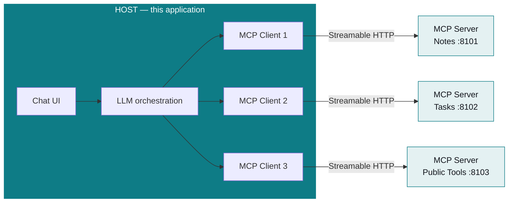
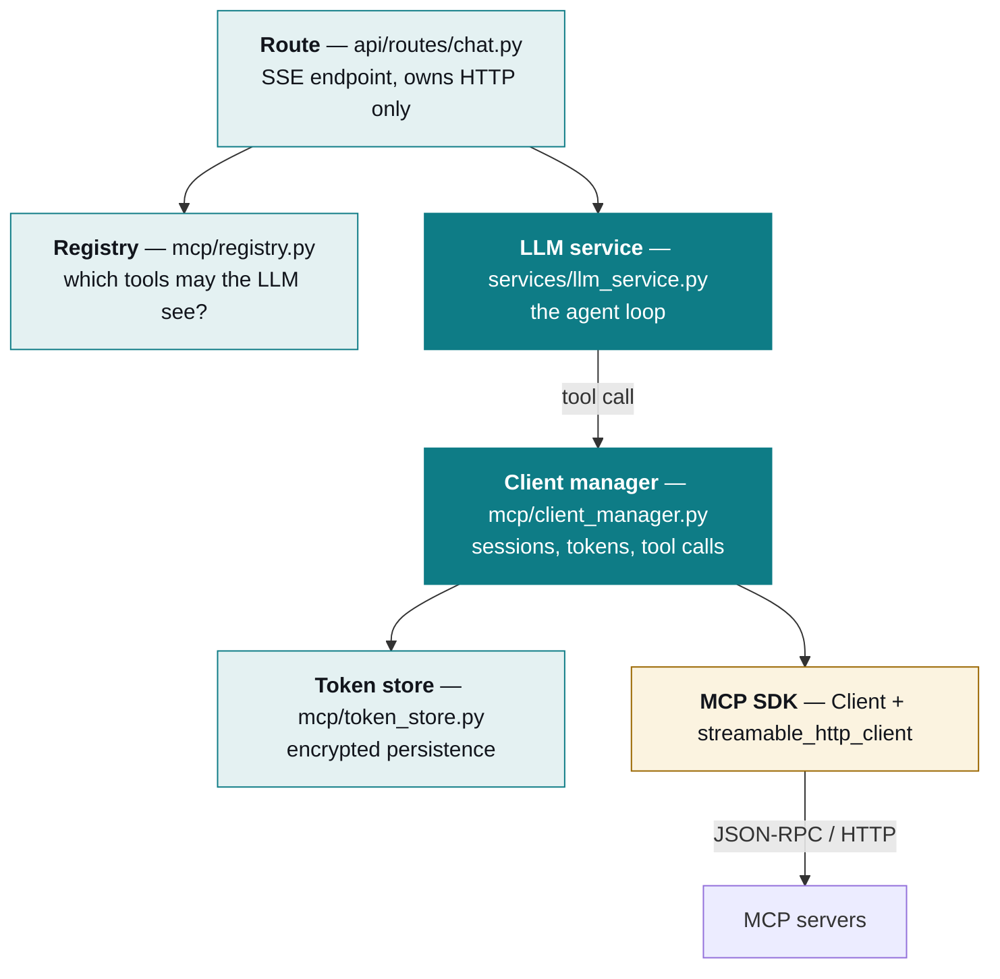
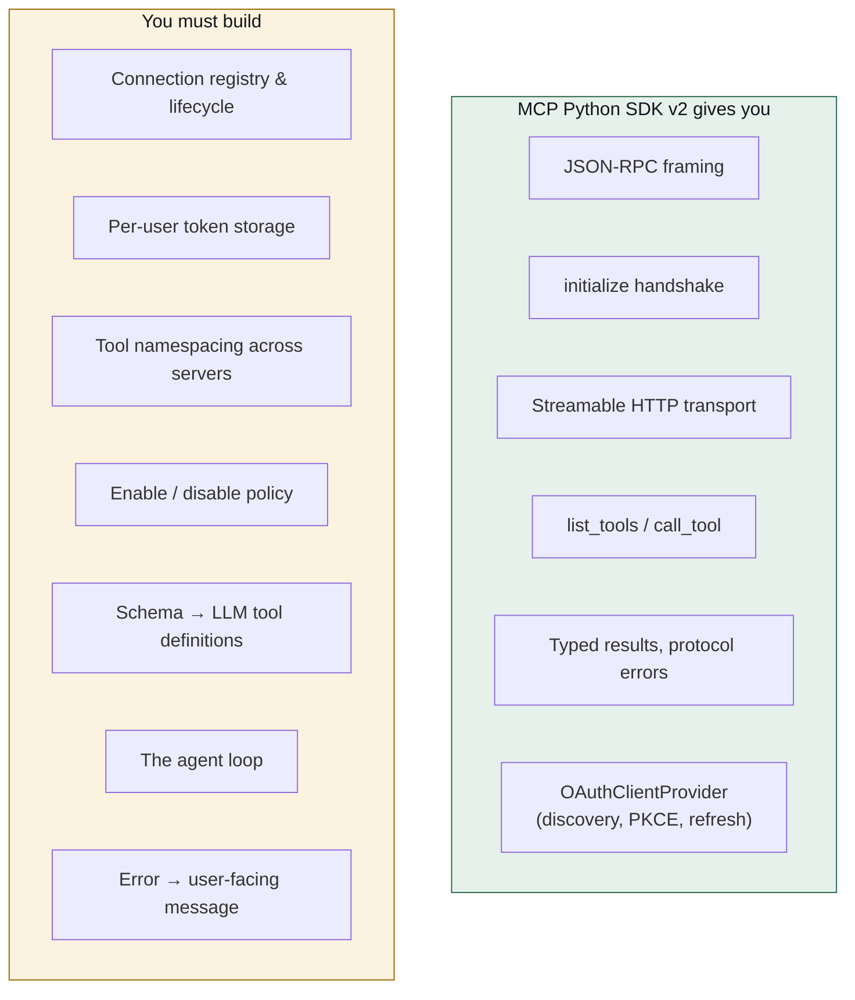
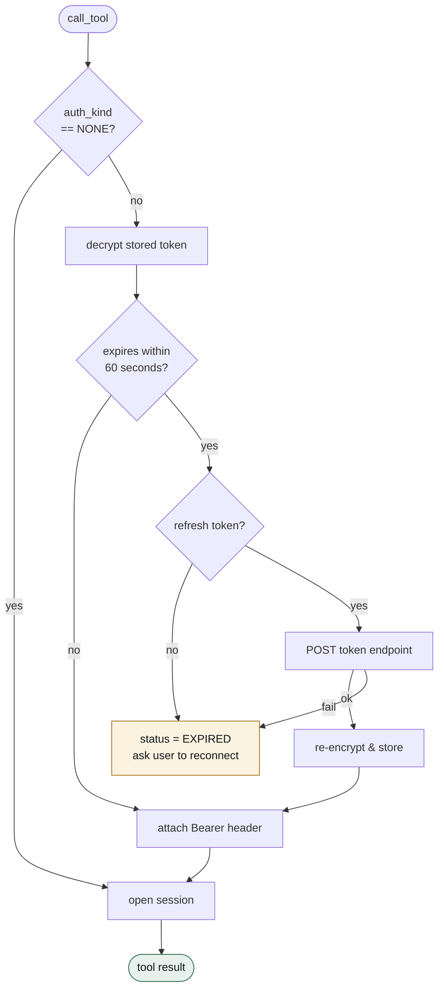
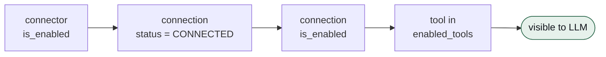
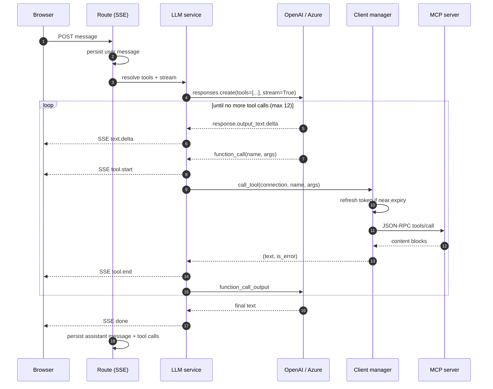
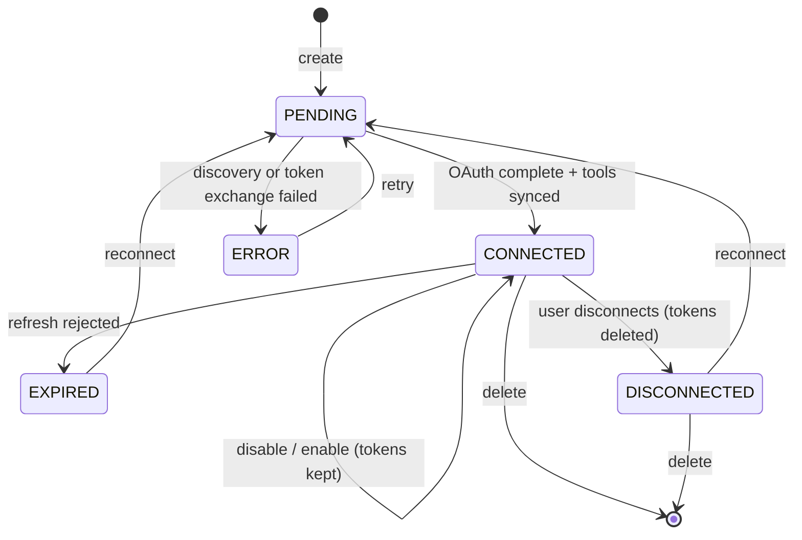

# MCP host architecture

How this app talks to many MCP servers at once — the client layer, the tool
registry, and the agent loop — plus an honest account of **what the SDKs give
you and what you must write yourself**.

Written to be reusable: the patterns here apply to any MCP host with multiple
authenticated connections, not just this project.

---

## 1. What a "host" actually is

The MCP spec separates three roles. Conflating them is the most common source
of confusion:



| Role | Count | Responsibility |
|---|---|---|
| **Host** | 1 | owns the LLM, the user, and the policy |
| **Client** | one **per connection** | speaks the protocol to exactly one server |
| **Server** | many | exposes tools, owns its own auth |

The rule that shapes everything below: **one client per connection, never one
client for all servers.** Each server has its own URL, its own token, its own
session, and its own failure modes. A shared client would leak state between
tenants and make per-connection auth impossible.

---

## 2. Layered architecture



Each layer has exactly one job:

* **Registry** answers *"which tools is this user allowed to use right now?"*
* **Client manager** answers *"how do I reach that server with a valid token?"*
* **LLM service** answers *"what does the model want to do next?"*

Keeping the first two apart is what makes enable/disable trivial: the registry
filters, the manager never needs to know why.

---

## 3. What the SDK does vs what you write

This is the section most tutorials skip. **The MCP SDK is a protocol client,
not a host framework.**



### What we import — the complete list

```python
from mcp import Client                                  # session + typed calls
from mcp.client.streamable_http import streamable_http_client   # transport
from mcp.shared.auth import OAuthToken, OAuthClientInformationFull  # types
from openai import AsyncOpenAI                          # LLM client
```

That is **all four imports**. Everything else in `app/mcp/` is ours.

### We deliberately do NOT use `openai-agents`

The Agents SDK ships `MCPServerStreamableHttp`, which looks like it does this
job for you:

```python
# The obvious approach — and why it does not work here
async with MCPServerStreamableHttp(
    params={"url": ..., "headers": {"Authorization": f"Bearer {token}"}}
) as server:
    agent = Agent(name="Assistant", mcp_servers=[server])
```

Three blockers, each fatal for a multi-tenant host:

| Problem | Consequence |
|---|---|
| Headers are **static** at construction | a token expiring mid-run cannot be refreshed |
| It owns its own connection | you cannot inject a pre-authorized session |
| No per-user policy hook | enable/disable and per-tool allow lists are unenforceable |

For a single-user CLI with a long-lived token, it is the right tool. For a host
serving many users with expiring OAuth tokens, you need the loop yourself — it
is roughly 80 lines, and you get exact control over refresh and policy.

> **Reusable rule:** the moment tools are *per-user* and *authenticated*, own
> your agent loop.

---

## 4. The client manager

### Sessions are per-operation, not long-lived

```python
@asynccontextmanager
async def session(self, connection: MCPConnection):
    headers = {}
    if connection.connector.auth_kind is not AuthKind.NONE:
        token = await self._get_valid_access_token(connection)   # refresh FIRST
        headers["Authorization"] = f"Bearer {token}"

    async with httpx.AsyncClient(headers=headers, timeout=30.0) as http_client:
        transport = streamable_http_client(url, http_client=http_client)
        async with Client(transport) as client:
            yield client
```

Why open a fresh session per call rather than pooling?

* Streamable HTTP in the 2026 spec is **stateless** — no `Mcp-Session-Id` ties a
  request to a worker, so a new session costs one round-trip.
* Long-lived sockets bring idle timeouts, silent half-open connections, and
  tokens that expire mid-session.
* **Token freshness is checked at the top of every operation**, which is only
  possible if the session is created there.

> **SDK gotcha, verified against v2.0.0:** `Client` enters the transport
> itself. Pass `streamable_http_client(...)` **un-entered**. Wrapping it in its
> own `async with` raises
> `'builtins.tuple' object does not support the asynchronous context manager protocol`.
> The published example gets this wrong.

### Token refresh happens before the request



The 60-second skew matters: without it a long tool call can start valid and
finish expired.

---

## 5. Tool resolution — the policy layer

Four independent conditions gate every tool. All must hold:



| Gate | Meaning | Who controls it |
|---|---|---|
| `connector.is_enabled` | global kill switch | operator |
| `status == CONNECTED` | credentials present and valid | system |
| `connection.is_enabled` | per-user toggle | **user** |
| `enabled_tools` | per-tool allow list | **user** |

Because `is_enabled` is separate from `status`, disabling **keeps the tokens**.
Re-enabling is instant and needs no re-authorization — the single most
user-visible payoff of this design.

### Namespacing prevents collisions

Two servers may both expose `search`. The qualified name keeps them distinct
*and* encodes the route back:

```
notes__search          →  connection A
crm__search            →  connection B
public-tools__add      →  connection C
```

```python
@property
def qualified_name(self) -> str:
    return f"{self.connector_slug}__{self.name}"
```

When the model calls `notes__search`, `index_by_qualified_name` maps it back to
the exact connection — no ambiguity, no guessing.

### Tools come from cache, not the network

`resolve_tools` reads `tools_cache` (JSONB, refreshed on connect and on demand).
Starting a chat therefore costs **zero** MCP round-trips, instead of one per
connected server. With six connectors that is the difference between an instant
first token and six sequential handshakes.

---

## 6. The agent loop



The core is ~30 lines:

```python
for _ in range(settings.llm_max_tool_iterations):     # bounded, never while True
    stream = await self._client.responses.create(
        model=model, instructions=SYSTEM_PROMPT,
        input=conversation, tools=tool_defs or None, stream=True,
    )

    async for event in stream:
        if event.type == "response.output_text.delta":
            yield {"type": "text.delta", "delta": event.delta}
        elif event.type == "response.completed":
            function_calls = [i for i in event.response.output
                              if i.type == "function_call"]

    if not function_calls:
        yield {"type": "done", ...}
        return                                         # ← the exit

    conversation.extend(_serialize_items(output_items))  # model's own turn
    for call in function_calls:
        record, output = await self._execute_tool(call, tool_index)
        conversation.append({
            "type": "function_call_output",
            "call_id": call["call_id"],                 # MUST echo exactly
            "output": output,
        })
```

Four details that are easy to get wrong:

1. **Bounded iteration.** `for _ in range(12)`, never `while True` — a model
   that loops on a failing tool would otherwise burn tokens forever.
2. **Echo `call_id` exactly.** The Responses API matches outputs to calls by
   this id. Mismatch it and the model silently ignores the result.
3. **Append the model's own output first**, then the tool outputs. Skipping the
   assistant turn corrupts the conversation shape.
4. **Tool errors are returned as text, not raised.** The model then explains the
   failure to the user, which is far better UX than a 500.

### Unavailable tools are refused, not executed

```python
resolved = tool_index.get(qualified)
if resolved is None:
    return record, "Error: this tool is not currently available to you."
```

If a user disables a connector mid-conversation, a stale tool call is rejected
by the host. **The registry filters, and the executor verifies** — never trust
the model's name resolution alone.

---

## 7. Connection lifecycle



Note the self-loop: **disable/enable does not change `status`.** That is the
whole point.

---

## 8. Rebuilding this pattern

A checklist for the next MCP host, in dependency order:

**1. Model the connection, not the server.** The unit is
`(user, server, credentials, policy)`. A global server list cannot express
per-user auth.

**2. Own the token lifecycle.** Store encrypted, refresh with a skew before
each operation, and mark `EXPIRED` rather than silently failing.

**3. Namespace tools by connection** — `{slug}__{tool}`. It solves collisions
and routing in one step.

**4. Cache the tool catalogue.** Never fan out `list_tools` on the chat path.

**5. Separate policy from transport.** A registry that decides *what is
allowed* and a manager that decides *how to reach it* keeps both simple.

**6. Write the agent loop.** Bounded iterations, echo `call_id`, return tool
errors as text, verify the tool is still permitted at call time.

**7. Stream everything.** Emit `tool.start` / `tool.end` as they happen — a
30-second tool call with no feedback feels broken.

### When to use the Agents SDK instead

| Situation | Choice |
|---|---|
| One user, static token, local servers | `openai-agents` — less code |
| Multi-user, OAuth, per-user policy | **own the loop** (this project) |
| Handoffs, guardrails, tracing needed | Agents SDK, with a custom MCP layer |

---

## 9. Protocol notes (MCP 2026-07-28, SDK v2)

Verified by introspecting the installed package:

| Change | Detail |
|---|---|
| `FastMCP` → `MCPServer` | `from mcp.server import MCPServer` |
| Transport args moved | `mcp.run(transport="streamable-http", host=..., port=...)` |
| snake_case wire types | `tool.input_schema`, `result.is_error` |
| Stateless Streamable HTTP | no `Mcp-Session-Id`; any replica may answer |
| ASGI mounting | `mcp.streamable_http_app()` mounts into FastAPI |
| Server auth | `token_verifier=` **and** `auth=AuthSettings(...)` together |
| Protected-resource metadata | served automatically at `/.well-known/oauth-protected-resource/<path>` |
| CIMD | `OAuthClientProvider(client_metadata_url=...)` |

**Error handling.** anyio task groups wrap transport failures in an
`ExceptionGroup` whose message — *"unhandled errors in a TaskGroup"* — tells the
user nothing. Flatten it:

```python
def _root_cause(exc: BaseException) -> str:
    inner = getattr(exc, "exceptions", None)
    if inner:
        return "; ".join(_root_cause(sub) for sub in inner)
    return str(exc).strip() or exc.__class__.__name__
```

Without this, "connection refused" reaches the UI as a meaningless string.

---

## File map

| File | Responsibility |
|---|---|
| `app/mcp/client_manager.py` | sessions, token refresh, `list_tools` / `call_tool` |
| `app/mcp/registry.py` | policy filtering, namespacing, schema → tool defs |
| `app/mcp/token_store.py` | `TokenStorage` backed by pgcrypto |
| `app/mcp/discovery.py` | RFC 9728 → RFC 8414 discovery chain |
| `app/services/llm_service.py` | the agent loop |
| `app/services/connector_service.py` | connect, enable, disconnect, delete |

Related: [AUTH.md](AUTH.md) for the OAuth flows, [DATABASE.md](DATABASE.md) for
storage.
